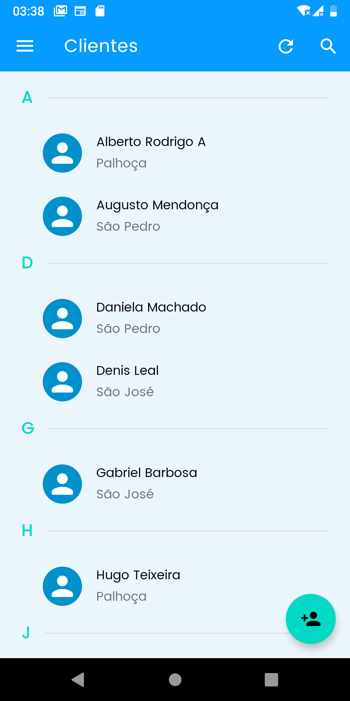
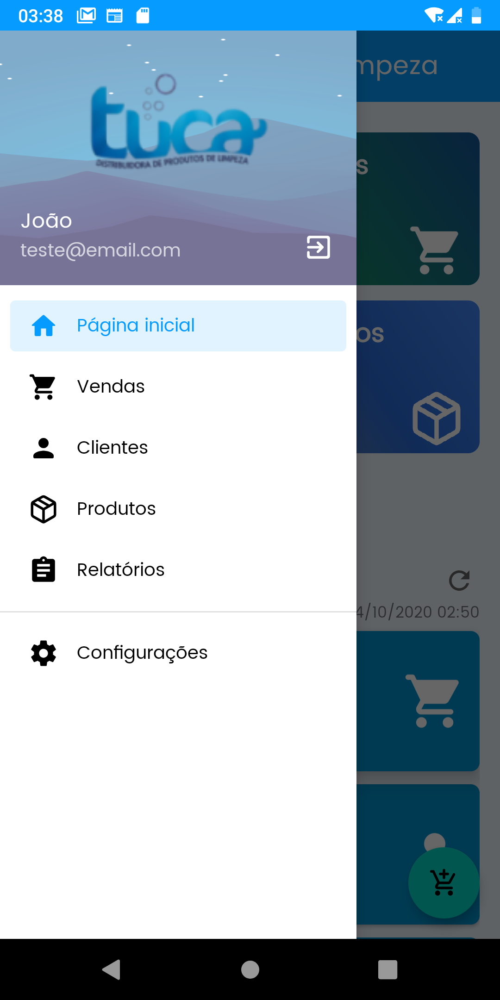

   

<h2 align="center">	
   

   
  
</h2>

 

## Projeto
Este é um projeto onde o objetivo é auxiliar no gerenciamento de uma empresa de venda de produtos de limpeza. Algumas de suas funcionalidades: 

* Realize o controle de suas vendas de forma fácil.
* Acompanhe a quantidade de vendas realizadas nos últimos meses.
* Busque de forma facilitada quais as vendas feitas para determinado cliente.
* Faça o controle de estoque dos seus produtos, com histórico de baixas.

## Tecnologias usadas
Algumas das tecnologias utilizadas neste projeto:

* **[Kotlin](https://kotlinlang.org)**

* **[Coroutines](https://kotlinlang.org/docs/reference/coroutines-overview.html)**

* **[Firebase](https://firebase.google.com)**

## Demo

### Aplicativo mobile

   
   
   
   
   

